<style type="text/css">
  body{
  font-size: 12pt;
}
</style>

<style type="text/css">
.title {
  display: none;
}

#getting-started img {
  margin-right: 10px;
}

</style>

# Methods for acoustic measurements

You will be working with `.wav` files which have recordings of speakers reading a word list (read twice), with each **target** sound embedded in the sentence frame "Say the word `CVC` quickly." The lab volunteer will use their knowledge of articulation, aerodynamics, and acoustics to inform how they measure the VOT of the initial C and the duration of the vowel.

## The data

Each recording will be organized according to speaker and can be found in the SAP Lab drive `(Studies/Burst_voice/Recordings/)` and will look something like this. A single volunteer will be responsible for at least two speakers (i.e., four `.wav` files):

<center>
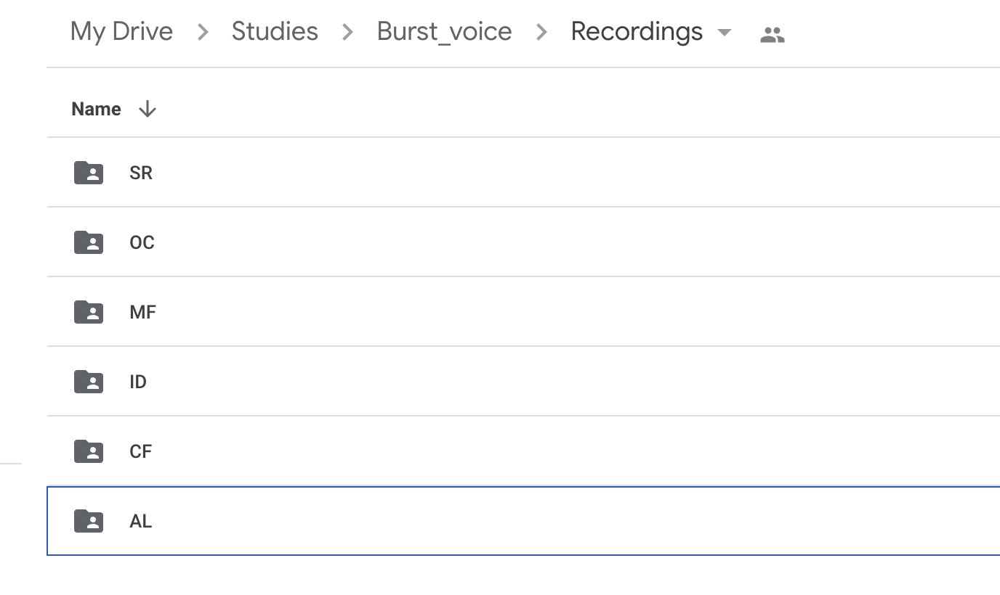{width=50% height=50%} 
</center>

The individual folder has two files labeled `XX_list1.wav' and `XX_list2.wav'. These have the exact same reading list, but just the second take. So we will have two recordings of the same target words. 

<center>
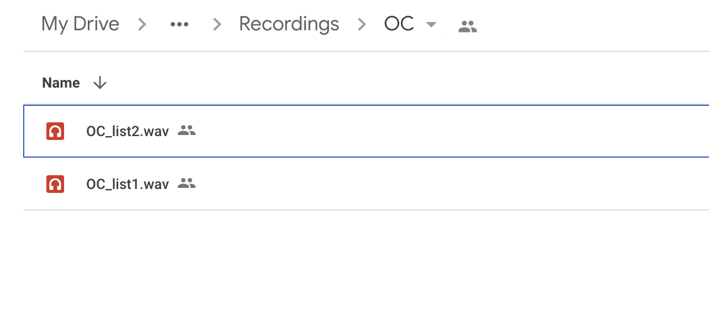{width=50% height=50%}
</center>

## Opening the file

**Download** the individual files to your local computer (see the video below if you don't know how to do this). For the purposes of this example, we will work with `OC_list1.wav`. The first two letters of the file name are the participant code.

**Open** the `.wav` file in `Praat`. It will appear in the Object window pane. Click `View and Edit` to examine the audio. It will be a fairly long sound file (you're not used to seeing files this long, but that's OK).

<center>
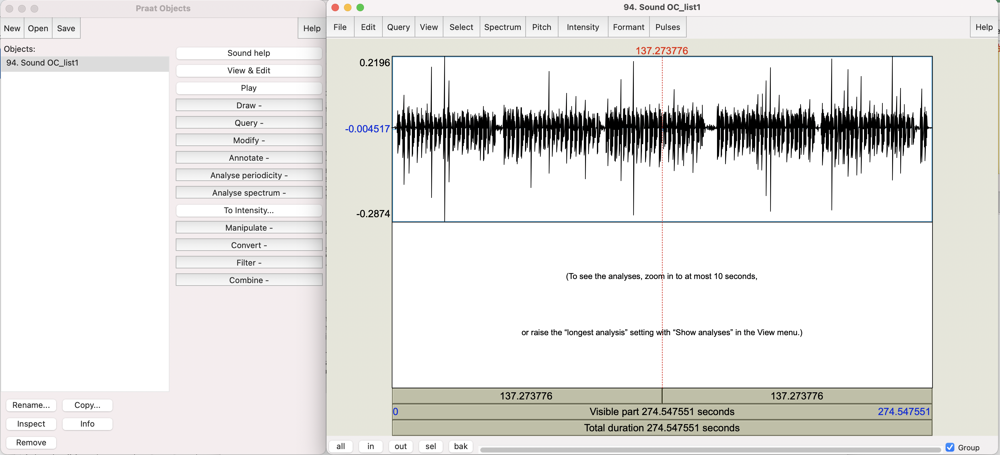
</center>
\

## Creating the TextGrid

Now we want to create a `TextGrid` file to accompany this long sound file. A text grid is a text file that you open **with** the sound file that allows you to annotate and put boundaries or demarcations on the sound file. These demarcations happen on **tiers** of the TextGrid. Once you have boundaries and labels made in the TextGrid associated with a sound file you can *query* the TextGrid and ask things like "how long are all of the **intervals** on a particular tier". Let's take a look at how this is done.

Select the Sound object, in this example, it would be `Sound OC_list1`. In the menu of buttons in the Objects window, click `Annotate` and from there `To TextGrid`.

<center>
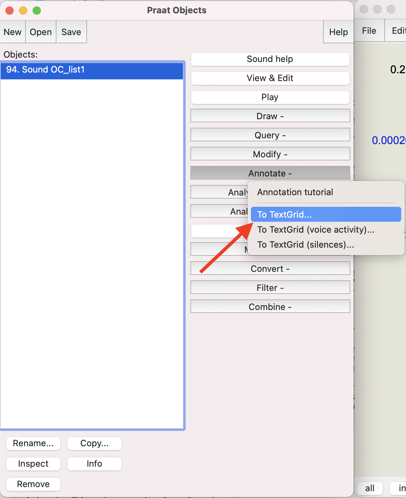{width=50% height=50%}
</center>
\

This will bring up a window form that asks for some variables. We want 2 tiers, one for `VOT` and one for `vdur` (vowel duration). Please label them *exactly* like this:

<center>
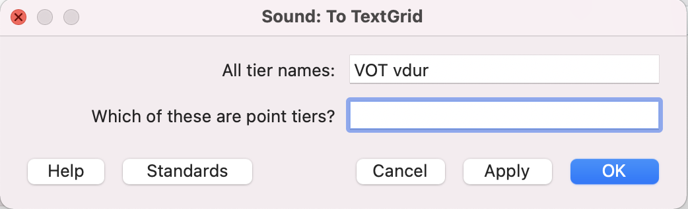{width=50% height=50%}
</center>
\

Neither of these are called "point" tiers, so you leave the field for "Which of these are point tiers?" blank. This will put a TextGrid object into the Objects window. It will be named the same as the sound file, in this case `TextGrid OC_list1`. 

Next, you must open the sound file *and* the TextGrid files together! You can select them both together by holding down the `shift` key. When both files are selected, click `View and Edit` again. 

This will open up a window with the waveform and spectrogram from the `.wav` file along with the TextGrid. Notice that there are two tiers on the TexGrid: VOT and vdur. Also notice that in the right panel of the window is all the IPA symbols. We won't worry about the IPA for this project, but it allows one to do broad transcription of the audio.

<center>
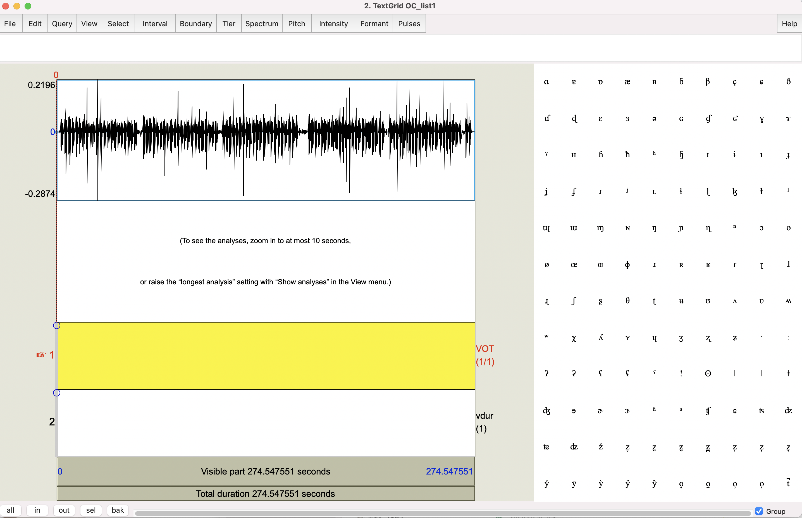
</center>
\

Zoom out all the way (Command-A, it might be CTRL-A on Windows) to see the entire waveform. Notice that you can't see the spectrogram if you're zoomed out this far. Let's zoom (select, then Command-N) in closer to see the first few sentences:

<center>
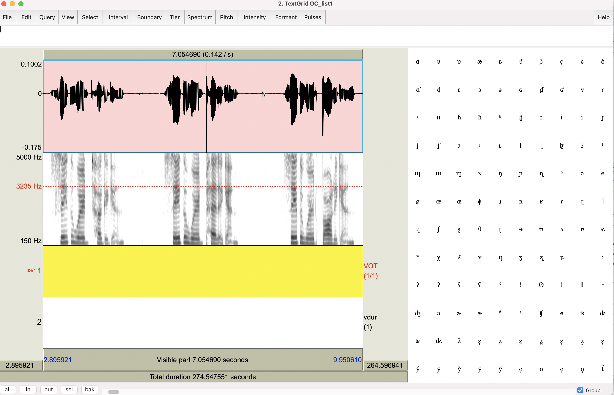
</center>
\

The zoomed in view allows you to see the which should look pretty nice. Make sure you're using a wideband spectrogram view. If your image isn't wideband, then go to Spectrum > Spectrogram settings. Make sure the window length is large (0.01s will be fine). You will use the spectrogram just for further evidence for your decisions on where to place boundaries. 

## Measuring VOT and Vdur

### Preliminaries 

You will work directly with this `.wav` + TextGrid combo view. 

1. Have the word list open on your screen. You will be constantly consulting this list to make sure you're listening to the correct word.

2. Ignore all of the sentence word frames and focus only on the **target** CVC words.

3. Zoom in to your sentence. Listen to the sentence, then zoom in on the target word. Watch this animated `gif`:


4. Some of the sentence frames (the first few participants) are "Say the word __ again," I then changed it to "Say the word __ quickly." This avoids the problem of having the final C of the target word being the onset of "again."

5. Notice the two tiers (VOT and vdur). You will insert boundaries and annotate *both* of these tiers for every target word.

### Adding interval boundaries

Now you will locate the onset of the release burst. In the example below (and most all of the tokens you'll be dealing with) it's very obvious where the stop is released. You'll see a loud transient (unstructured energy or noise that is brief)

1. The onset is easy to identify. Zoom into the onset, and on the VOT tier (which should be tier 1), add an interval:

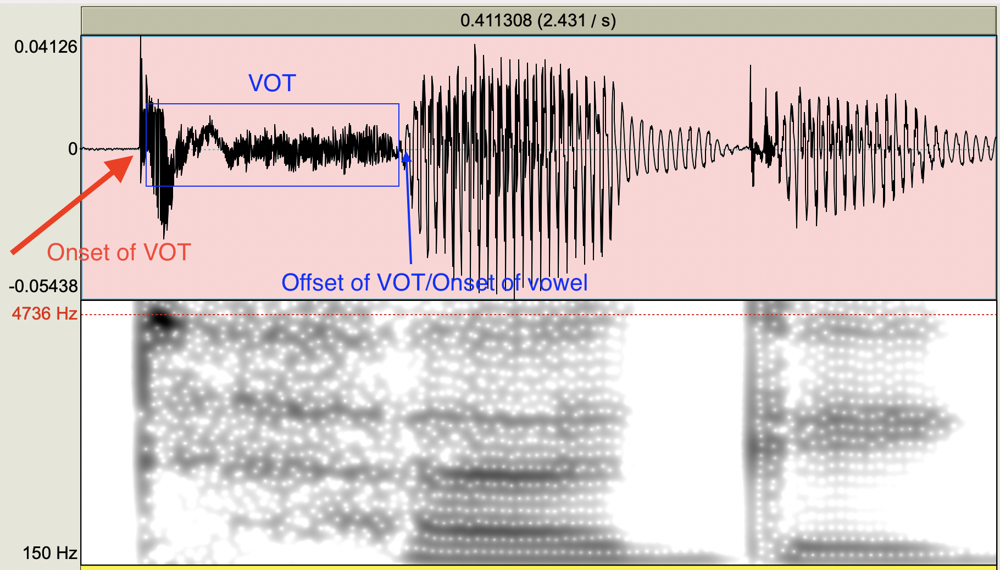

The **offset** is harder, and **VERY** important to get right for the purposes of this study. The effects I hope to find are going to be small so it's important that you're careful in identifying the end of the VOT, and that you stay consistent in your measuring techniques.

2. In this case, the offset is located as the END of the VOT or aspiration noise at the zero crossing. You can confirm this by looking at the spectrogram too. The offset of the aspiration/VOT IS the onset of the vowel!

<center>
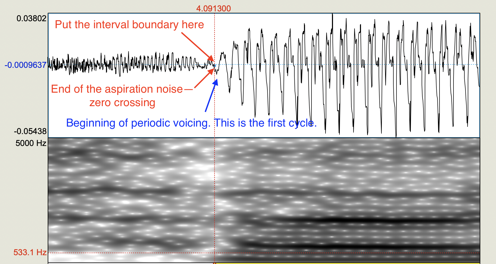
</center>

3. Identify the offset of the vowel. This should be fairly clear. Notice the periodic voicing of the vowel. It is loud. As the vowel starts to end, it dramatically decreases in amplitude. The shape of the periodic voicing also changes to reflect the voicing (if it is voiced, like the "g" in "tug" in this example) of the final consonant.

4. Once you have identified the boundary intervals (VOT onset, VOT offset/Vowel onset, Vowel offset), you can go back and insert your intervals on the TextGrids. 

5. There are two tiers (VOT and Vdur). You must put Interval boundaries on the appropriate tier! The way you insert an interval boundary is by placing your cursor at the point in the waveform where you want it. Then go to Interval > Add interval on tier 1 (this will add it to the Tier 1 or the VOT tier).

6. Add intervals to Tier 1 for VOT onset and VOT offset. Immediately after you add the Tier 1 interval for VOT offset you must add a Tier 2 interval (vowel onset). The VOT offset and the Vowel onset ARE THE SAME, but with the interval added to different tiers.

7. Finally add your interval boundary to the vowel offset on Tier 2 (Vdur).

```
Tip: Learn the keyboard shortcuts for adding boundaries on the interval tiers. For a Mac (if you're in the SAP Lab), it is Command-1 for Tier 1 (VOT) and Command-2 for Tier 2 (Vdur).
```
 
8. You will end up with two "chunks", one for VOT and one for Vdur. Watch this gif:


9. Now you need to label the intervals. Name each chunk with the name of the target word. In this example, it is the first word of the list, "tug."


10. I've walked you through the first example. You now need to do this for each target word in the file. There are about 120 of them. 

11. It is **VERY** important that you **SAVE** your TextGrid periodically. I would recommend you save the TextGrid in the same folder where the audio is. It will have the same name as the audio, but with the extension `.TextGrid`. The way you do this is by going to File > Save TextGrid as text file... in the audio/TextGrid combo window you've been working in. Every time you save it, it will ask you whether you want to override the already saved one. Say "yes."


## Running the duration script

Once you've added your VOT and Vdur tier intervals, you will be running a Praat "script." We will be using a script (a little program that will automatically do some operation on files) that goes through the TextGrid that you've saved and measure the duration of each interval (once for the VOT tier and once for the Vdur tier).

The duration extraction script is located [here](https://drive.google.com/drive/folders/12Ohw5w_Noeo4sKyS5ostS6ra8_rHl02b?usp=share_link). Download it to the folder where your audio file and TextGrid file is located. 

Once you are done demarcating the intervals of all the target words in the audio file in both the VOT and Vdur tiers, it will be time to run the script. 

1. To run the script you need to have your audio file (`.wav`) (in our example `OC_list1.wav`) and the associated TextGrid file (in our example OC_list1.TextGrid) in the same folder. If you're working on lab computers it's convenient to have this all on your desktop.

2. With Praat open, open the duration extraction script. Do this by going to Praat > Open Praat script... and finding the script in your folder. The open script will look like this:

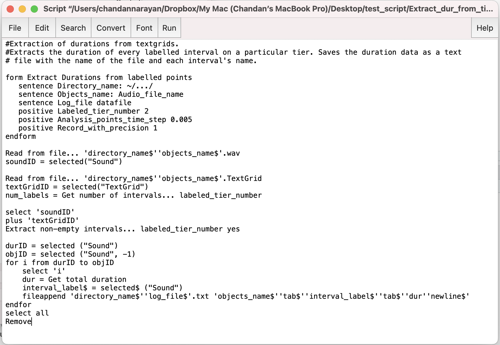
3. To "run" the script go to Run > Run. You can also press Command-R on the lab macs. 

4. Running the script will open a form. You need to enter some parameters. "Directory name" is where the audio and TextGrid are located. In the example below, the folder is OC, which is on the Desktop, which is under the root (~). If you're working on the Lab computers I'd recommend keeping the same structure.

The "Objects name" is the name of the audio and TextGrid files. In the example, they're both "OC_list1". "Log File" is the name that you want the output file to be called. Please call it exactly as the Objects name file, but with the extension of EITHER "_VOT" or "_Vdur". "Labeled tier number" is the tier you want the script to "look" at. You will first run the script on the VOT tier, which is tier 1. So input "1" here and the Log file should be "OC_list1_VOT". Ignore the last two parameters.

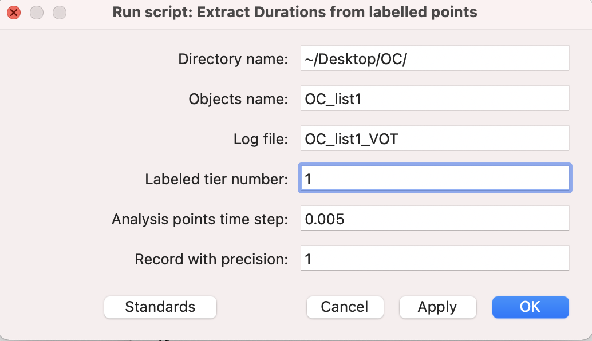{width=50% height=50%}

Click "OK". This will put a text file in your folder called "OC_list1_VOT.txt". Open it up and inspect it. It should 


4. Once you run the script, and provided your TextGrid was labeled correctly and the intervals are correct, there will be a `.txt` file in the folder where you saved the data. It will also remove the objects from the Objects window. The data will look something like this:

<center>
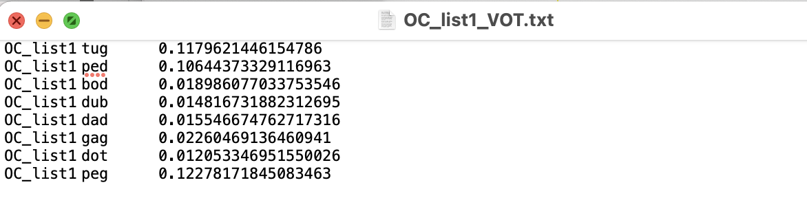
</center>

Notice the data has three columns, the file name (OC_list1) and the target word and finally the duration of the VOT.

5. Then do the **exact** same process as in (4) but with Tier 2, the Vdur tier. The resulting file, named OC_list2_vdur.txt will look like this:

<center>
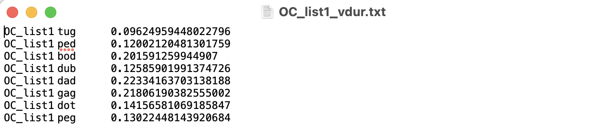
</center>


